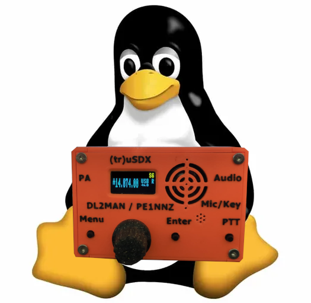
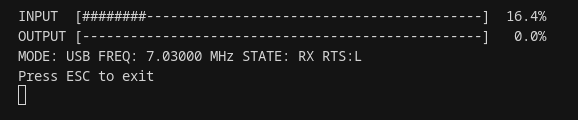
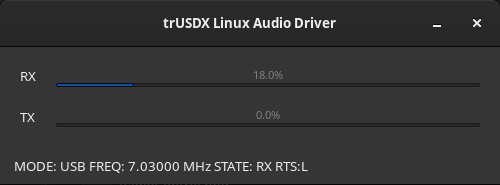
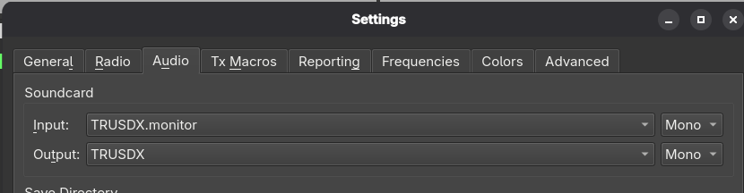
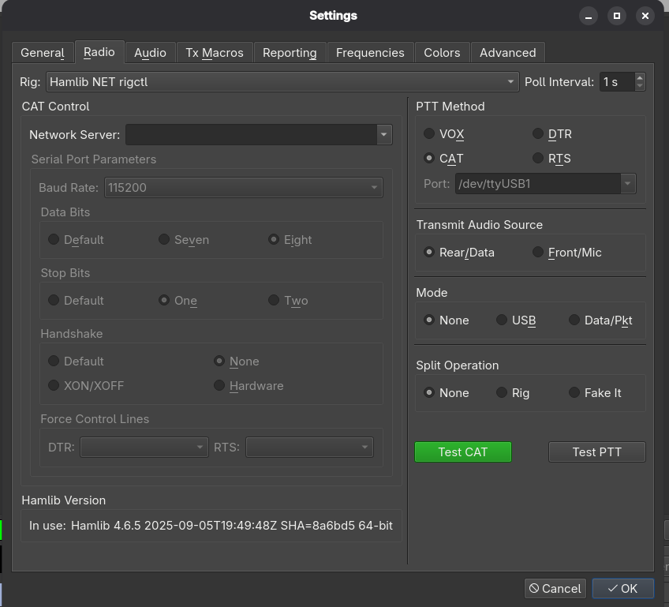
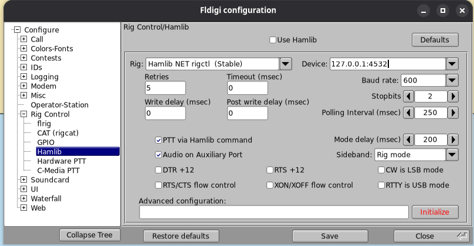

<div align="center">
  
</div>

# trUSDX Linux Audio Driver

A native Linux application for interfacing with the trUSDX QRP transceiver, providing audio bridge functionality, CAT control, and rigctl protocol support.

## Features

- **Audio Bridge**: Bidirectional audio streaming between PulseAudio and the trUSDX radio
- **Dual Interface**: Both command-line (CLI) and graphical (GUI) interfaces
- **rigctl Support**: Compatible with hamlib and other rig control software via rigctl protocol
- **CAT Control**: Full CAT command support for frequency, mode, and transmit control
- **Real-time Monitoring**: Audio level meters and status display
- **AppImage Distribution**: Pre-built AppImage for easy installation on any Linux distribution

## Screenshots

### Command Line Interface



The command-line interface provides real-time monitoring of audio levels, frequency, mode, and transmit state.

### Graphical User Interface



The GTK-based graphical interface displays audio level meters and radio status in a user-friendly window.

### Audio Control



Monitor and control audio levels for both receive and transmit operations.

### Radio Control



Full control over radio parameters including frequency, mode, and transmit state.

### fldigi Integration



Seamless integration with fldigi and other hamlib-compatible software via rigctl protocol.

## Requirements

- Linux system with PulseAudio
- trUSDX radio connected via USB serial port
- GTK 3.24+ (for GUI)
- Appropriate permissions to access serial port (usually requires adding user to `dialout` group)

## Installation

### From AppImage

1. Download the latest AppImage from the releases page
2. Make it executable: `chmod +x trusdx_linux_driver.AppImage`
3. Run: `./trusdx_linux_driver.AppImage`

### From Source

1. Install Rust toolchain: `curl --proto '=https' --tlsv1.2 -sSf https://sh.rustup.rs | sh`
2. Install system dependencies:
   - Debian/Ubuntu: `sudo apt-get install libpulse-dev libgtk-3-dev libudev-dev`
   - Arch: `sudo pacman -S pulseaudio gtk3 libudev`
   - Fedora: `sudo dnf install pulseaudio-devel gtk3-devel systemd-devel`
3. Clone the repository: `git clone <repository-url>`
4. Build: `cargo build --release`
5. Run: `./target/release/trusdx_linux_driver`

## Usage

### Command Line Interface

The application starts with a CLI interface showing:
- Real-time audio levels (RX/TX)
- Current frequency and mode
- Transmit state
- RTS line status

Press `ESC` to gracefully shutdown the application.

### Graphical Interface

A GTK-based GUI window displays:
- RX and TX audio level meters
- Current frequency, mode, and state
- RTS line status

Close the window to exit the application.

### rigctl Integration

The application exposes a rigctl-compatible server on `127.0.0.1:4532`. You can use it with:
- WSJT-X
- fldigi
- Any hamlib-compatible software

Example:
```bash
rigctl -m 2 -r 127.0.0.1:4532 f
```

## Building AppImage

To build an AppImage:

```bash
cargo install cargo-appimage
cargo appimage
```

The AppImage will be generated in `target/appimage/`.

## Technical Details

- **Audio Format**: 8 kHz sample rate, 16-bit PCM
- **Serial Protocol**: CAT commands over USB serial
- **rigctl Port**: 127.0.0.1:4532
- **Threading**: Multi-threaded architecture for concurrent audio processing and control

## Troubleshooting

### GUI doesn't appear when launched from file manager

The application requires proper environment variables. If launching from a file manager, ensure:
- `DISPLAY` or `WAYLAND_DISPLAY` is set
- `XDG_RUNTIME_DIR` is set (for Wayland)
- `DBUS_SESSION_BUS_ADDRESS` is set

### Serial port permission denied

Add your user to the `dialout` group:
```bash
sudo usermod -a -G dialout $USER
```
Then log out and log back in.

### Audio not working

Ensure PulseAudio is running:
```bash
pulseaudio --check || pulseaudio --start
```

## Credits

1. **[FT8CN](https://github.com/N0BOY/FT8CN)** - An Android FT8 application that provided inspiration for digital mode integration

2. **[trusdx-audio](https://github.com/olgierd/trusdx-audio)** - Python implementation for TRUSDX audio over CAT

3. **[TRUSDX Audio Documentation](https://dl2man.de/wp-content/uploads/2022/01/wp.php/trusdx-audio.zip)** - Original documentation and reference implementation

## License

This project is licensed under the MIT License.

## Contributing

Contributions are welcome! Please feel free to submit a Pull Request.

## Acknowledgments

Special thanks to the trUSDX community and the developers of the projects listed in the Credits section for their pioneering work in trUSDX audio integration.

