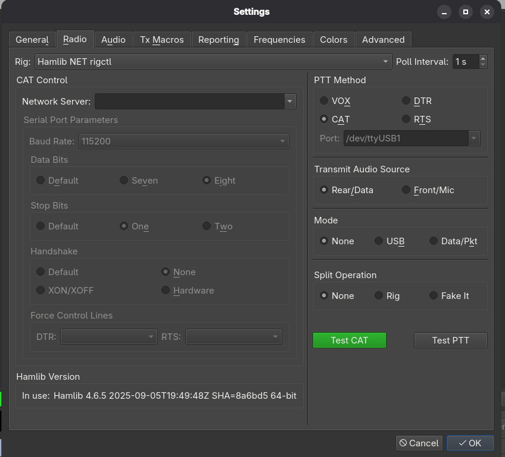
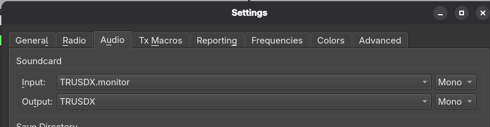

# trusdxAudio

A Rust-based Linux driver for the TRUSDX QRP transceiver that provides audio interface and rigctl compatibility for digital modes like FT8.

## Overview

This project was built entirely for selfish reasons - I needed a way to use my TRUSDX with digital mode software on Linux. However, I hope someone out there can find it useful too!

The driver automatically creates a PulseAudio interface for the TRUSDX and handles cleanup when the program exits. It implements the rigctl protocol, making it compatible with popular digital mode software like WSJT-X, JTDX, and others.

## Features

- **Automatic Audio Interface**: Creates and manages PulseAudio interfaces automatically
- **rigctl Compatibility**: Implements the rigctl protocol for seamless integration with digital mode software
- **Clean Shutdown**: Automatically cleans up audio interfaces when the program exits
- **Real-time Audio Monitoring**: Provides audio level monitoring and frequency display
- **Serial Communication**: Handles TRUSDX serial communication and control

## Credits

This project builds upon the excellent work of others in the amateur radio community:

1. **[FT8CN](https://github.com/N0BOY/FT8CN)** - An Android FT8 application that provided inspiration for digital mode integration
2. **[trusdx-audio](https://github.com/olgierd/trusdx-audio)** - Python implementation for TRUSDX audio over CAT
3. **[TRUSDX Audio Documentation](https://dl2man.de/wp-content/uploads/2022/01/wp.php/trusdx-audio.zip)** - Original documentation and reference implementation

## Audio Configuration

When using with digital mode software, configure your audio settings as follows:

- **Incoming Audio Stream**: `TRUSDX.monitor`
- **Outgoing Audio Stream**: `TRUSDX`

## rigctl Configuration

The driver implements the rigctl protocol, so configure your digital mode software (WSJT-X, JTDX, etc.) as if it's talking to a standard rigctl interface:



## Audio Control

The driver provides real-time audio level monitoring and control:



## Building and Running

### Prerequisites

- Rust (latest stable)
- PulseAudio development libraries
- Serial port access

### Build

```bash
cargo build --release
```

### Run

```bash
cargo run --release
```

The program will:
1. Clean up any existing TRUSDX audio interfaces
2. Create new PulseAudio interfaces
3. Establish serial communication with the TRUSDX
4. Start the rigctl server
5. Begin audio bridging

Press `Esc` to gracefully shutdown the program.

## Dependencies

- `libpulse-binding` - PulseAudio integration
- `serialport` - Serial communication
- `tiny_http` - HTTP server for rigctl
- `anyhow` - Error handling
- `chrono` - Time handling

## Full Disclosure

I am a software developer by trade, but I'm still learning Rust. I heavily leveraged AI assistance for development, particularly for:
- Rust syntax and best practices
- Audio processing concepts
- Serial communication protocols
- Error handling patterns

While the core functionality works, there may be rough edges or non-idiomatic Rust code. Feedback and contributions are welcome!

## License

This project is licensed under the MIT License. Please use responsibly and in accordance with your local amateur radio regulations.

## Disclaimer

This software is provided as-is for educational and experimental purposes. Use at your own risk. The author is not responsible for any damage to equipment or violations of regulations.

---
